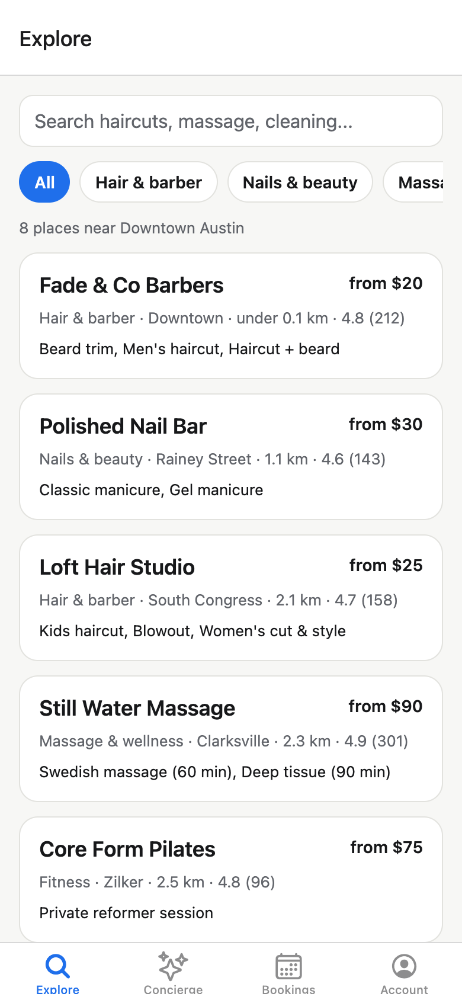
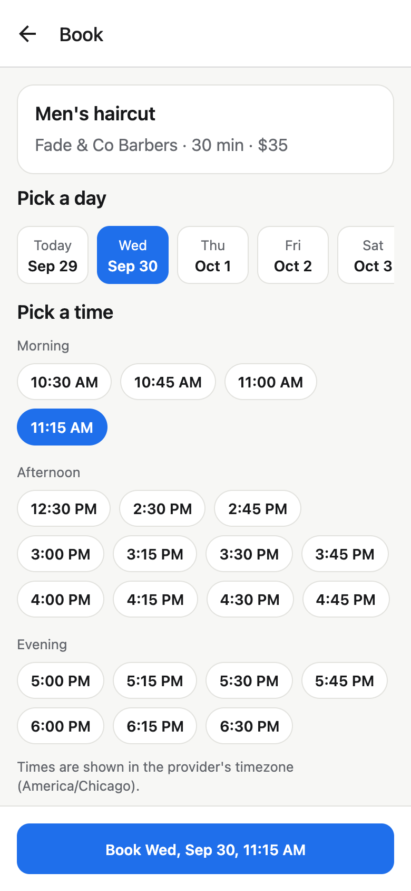
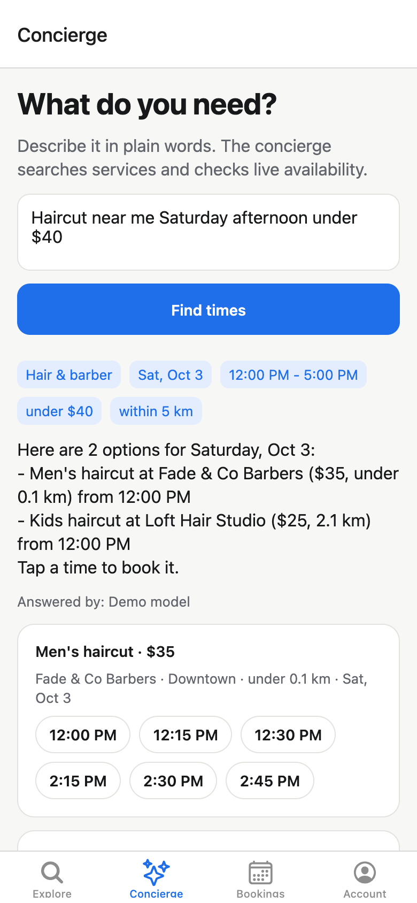
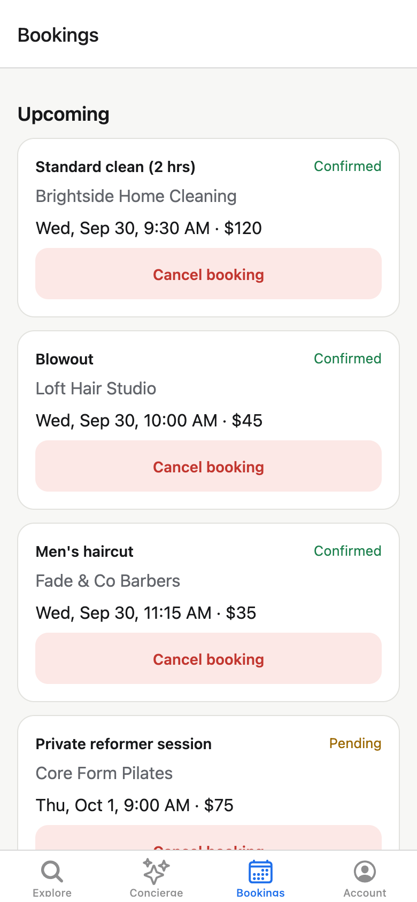
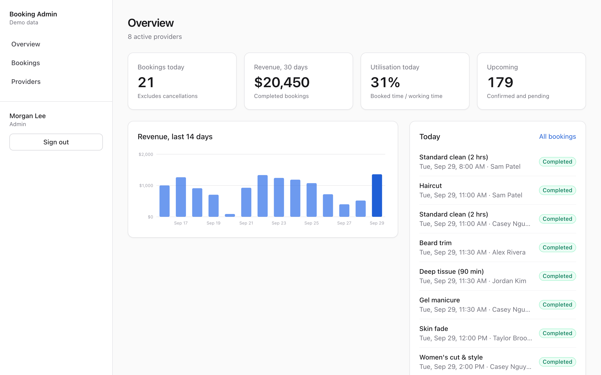
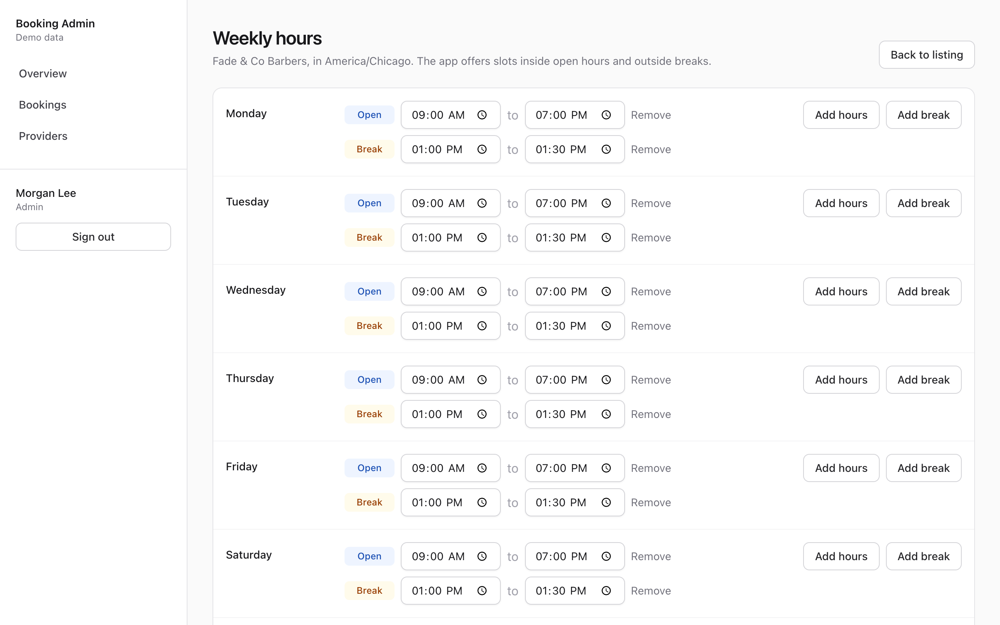
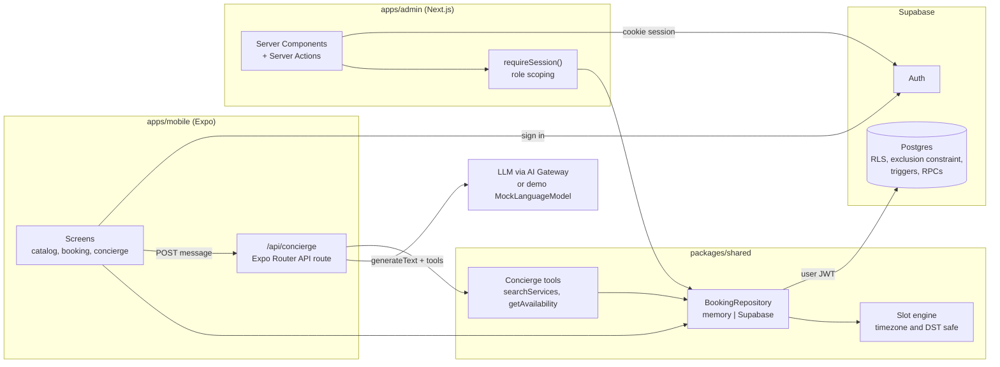

# rn-booking

An on-demand services booking product: an Expo app for customers, a Next.js admin for staff, and a Supabase backend that makes double-booking impossible.

[](https://github.com/OwaisMunawar/rn-booking/actions/workflows/ci.yml)
[](LICENSE)
[](https://docs.expo.dev/versions/v57.0.0/)
[](https://nextjs.org)

<p>
  
  
  
  
</p>
<p>
  
  
</p>

<sub>Mobile screenshots are the Expo app's web build at phone size (react-native-web); admin screenshots are the production Next.js build. Both in demo mode.</sub>

## Why

Booking apps look simple until two customers tap the same 2:30 slot, a provider's lunch break moves, or the clocks change. This repo is a small but complete take on that problem, built the way I would build it for a client:

- The **slot engine** is one pure, heavily tested TypeScript module shared by the app, the admin and the AI concierge, so every surface agrees on what is bookable.
- **Postgres enforces the invariants** (no overlapping bookings, working hours, who can see what) instead of trusting clients.
- It **runs with zero setup**: no Supabase project, no API key. Demo mode uses the same code paths with in-memory data and a deterministic model.

## Features

### Mobile (Expo SDK 57, Expo Router)

- Browse and search providers by category, nearest first, with prices and ratings
- Provider detail with services, duration and price
- 14-day date strip and time slots grouped by morning, afternoon and evening, shown in the provider's timezone
- Book, then see and cancel upcoming bookings
- **AI concierge**: type "haircut near me Saturday afternoon under $40" and get bookable times; tap one to open the booking screen pre-selected
- Email sign-in against Supabase, or a built-in demo customer

### Admin (Next.js 16, App Router, Tailwind)

- KPI cards: bookings today, 30-day revenue, utilisation (booked time over working time), upcoming
- Revenue chart for the last 14 days, rendered as server-side SVG
- Bookings table with time, status and provider filters, and inline status changes
- Provider, service and weekly-hours management (open hours plus breaks per weekday)
- Role-based access checked on the server: admins see everything; providers only their own listing and bookings

### Backend (Supabase)

- Tables for profiles, providers, services, availability rules and bookings
- Row level security: customers see their own bookings, providers see theirs, admins see all
- A `btree_gist` **exclusion constraint** blocks overlapping active bookings per provider, buffers included, even under concurrent inserts
- A trigger derives end time, buffer and price from the service and rejects times outside working hours
- RPCs for booking as the signed-in user, replacing weekly hours atomically, and exposing busy intervals without customer data
- `seed.sql` with 8 users, 8 providers, 16 services and a month of bookings relative to today

## Architecture



Key decisions (npm workspaces, where authorisation lives, how double-booking is prevented, why the concierge runs server-side) are written up with the alternatives I rejected in [docs/ARCHITECTURE.md](docs/ARCHITECTURE.md).

```
apps/
  mobile/     Expo app. src/app = routes only, src/features/* = screens and hooks,
              src/server = code that only API routes may import (lint-enforced)
  admin/      Next.js admin. src/server = server-only data access, auth and actions
packages/
  shared/     zod schemas, slot engine, repositories, concierge tools, demo data
supabase/     migrations, seed.sql, local config
```

## Tech stack

| Area    | Choice                                                                            |
| ------- | --------------------------------------------------------------------------------- |
| Mobile  | Expo SDK 57, React Native 0.86, Expo Router (typed routes), TanStack Query        |
| AI      | Vercel AI SDK 7 (`generateText`, tool calling), AI Gateway, `MockLanguageModelV4` |
| Admin   | Next.js 16 App Router, Server Actions, Tailwind CSS 4, `@supabase/ssr`            |
| Backend | Supabase: Postgres 17, RLS, `btree_gist`, PL/pgSQL triggers and RPCs, Auth        |
| Shared  | TypeScript (strict), zod 4                                                        |
| Quality | Vitest (+ v8 coverage), Playwright, Maestro, ESLint, Prettier, GitHub Actions     |
| Tooling | npm workspaces, Supabase CLI, Dependabot                                          |

## Quick start (demo mode)

Requires Node 22 and npm 10 or newer.

```bash
npm ci
npm run dev:admin    # http://localhost:3000, pick "Continue as Morgan Lee" (admin) or "Marcus Hale" (provider)
npm run dev:mobile   # press i for iOS simulator, a for Android, w for web
```

No environment variables are needed. Data lives in memory and resets on restart. The concierge answers through a deterministic mock model that drives the real tool loop; add `AI_GATEWAY_API_KEY` to `apps/mobile/.env.local` to use a real model (`CONCIERGE_MODEL` picks which, default `openai/gpt-5-mini`).

The concierge route needs the Expo dev server (or a server export). If the app cannot reach it, it answers on-device with the rule-based parser and labels the answer "On-device rules".

## Supabase setup

With Docker running and the [Supabase CLI](https://supabase.com/docs/guides/local-development) installed:

```bash
npm run db:start     # starts a local stack, applies migrations and seed.sql
```

Then create `.env.local` files from the examples, using the URL and anon key printed by `supabase status`:

```bash
# apps/mobile/.env.local
EXPO_PUBLIC_SUPABASE_URL=http://127.0.0.1:54421
EXPO_PUBLIC_SUPABASE_ANON_KEY=<anon key>

# apps/admin/.env.local
NEXT_PUBLIC_SUPABASE_URL=http://127.0.0.1:54421
NEXT_PUBLIC_SUPABASE_ANON_KEY=<anon key>
```

Seeded local accounts (password `demo-password`, local database only):

| Email                  | Role     | Sees                                 |
| ---------------------- | -------- | ------------------------------------ |
| `admin@example.com`    | admin    | everything                           |
| `provider@example.com` | provider | Fade & Co Barbers only               |
| `customer@example.com` | customer | the app, and only their own bookings |

Other commands: `npm run db:reset` re-applies migrations and seed, `npm run db:types` regenerates `packages/shared/src/database.types.ts`. The ports in `supabase/config.toml` are shifted to 544xx so the stack can run next to another local Supabase project.

To point at a hosted project, run `supabase link` and `supabase db push`, then use that project's URL and anon key. Do not run `seed.sql` against a hosted project.

## Quality

```bash
npm run check              # format, lint, typecheck, unit tests, admin build
npm run test:integration   # repository + RLS tests against the local Supabase stack
npm run test:e2e           # Playwright smoke tests against a production admin build
```

- **Slot engine**: 40+ cases covering breaks, buffers, back-to-back bookings, overlaps at either edge, minimum notice, half-hour offsets, the provider's calendar date versus UTC, US and EU DST transitions (skipped and repeated hours) and date overrides. Tests run with the process timezone pinned to Honolulu to prove nothing depends on it.
- **Coverage**: `packages/shared` enforces 90% lines, functions and statements and 85% branches (currently about 99% lines).
- **Database**: 19 integration tests sign in as each role and check RLS, the exclusion constraint (including two concurrent inserts for one slot), the working-hours trigger, ownership rules and role-escalation attempts.
- **Admin**: unit tests for role scoping and the signed demo cookie; Playwright covers login, forged cookies, role scoping, filters and CRUD.
- **Mobile**: unit tests for the concierge route (demo loop, a scripted live model, provider failure fallback) and the client fallback. Maestro flows for the booking and concierge paths are in `apps/mobile/.maestro` and run against a development build (`npx expo run:ios`, then `maestro test apps/mobile/.maestro`).
- **CI** runs all of the above except Maestro, plus an Expo web export and a check that the generated database types match the migrations.

## Roadmap

- Run the Maestro flows in CI on EAS Build
- Device location for "near me" (currently a fixed downtown Austin point)
- Date overrides and holidays in the admin UI (the engine supports them; they are not persisted yet)
- Streaming concierge replies and multi-turn follow-ups ("anything later?")
- Payments and deposits, reminders and push notifications
- Staff members per provider, each with their own calendar
- Deploy scripts for EAS Hosting and Vercel

## License

[MIT](LICENSE)

---

Built by [Owais Munawwar](https://github.com/OwaisMunawar) — available for React Native, AI and iOS work on [Upwork](https://www.upwork.com/freelancers/owaism11).
